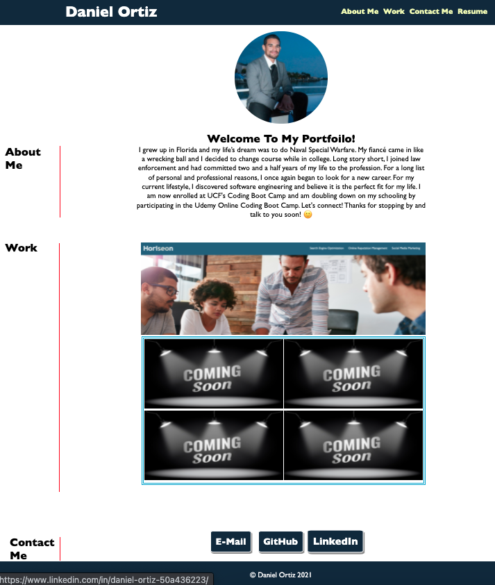

# Daniel Ortiz' Professional Portfolio

## Description

Looking for a web designer? Look no further! Hey, my name is Daniel, and I am a full stack developer. What’s a full stack developer? A full stack developer is able to build a front-end website that will capture your client’s attention and create a pleasurable experience while they surf your site. I am also skilled in generating an impressive back-end interface that you and your employees can navigate with ease. With your back-end interface you’ll be able to generate schedules, produce payroll, manage data, and so much more! What are you waiting for? Let’s team up today! 

## I'm skilled at the following Languages:

1. HTML
2. CSS
3. Bootstrap
4. JavaScript
5. jQuery
6. Node.js
7. MySQL
8. MongoDB
9. Express.js
10. React.js

## What was created:

1. When my portfolio is loaded you are presented with my name, a profile picture, links to sections about me, my work, and how to contact me.
2. When you click the links in the navigation bar in the top right hand corner, you are taken to the corresponding topics.
3. When you are presented with my first application the image is larger than the others.
4. When you click the images you are taken to an appropriate website.
5. When you resize the page you will be presented a responsive layout that adapts to my viewport.

Looking to team up? click here -->  https://coderortiz.github.io/dortiz-portfolio/